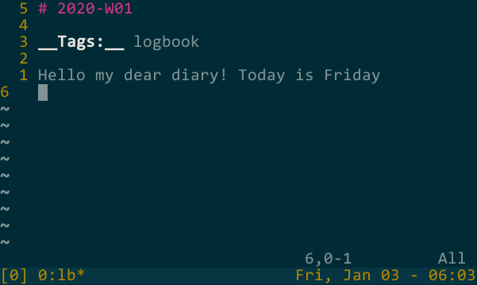

# Alpinist

Personal knowledge service. 

## TL;DR
- stores notes in [markdown format](base/note/welcome.md) in personal remote git repository
- periodically fetches and previews them in read-only web-service
- has [chat-bot](tg/src/main/java/com/marnikitta/alpinist/tg/TelegramService.java) for quick-notes
- manual local file editing is the main interface to the service
- has bunch of [bash helper functions](functions.sh)

It is fast, has multi-device access, allows offline editing, collaborative and gives user full control in terms of the recently published paper
[Kleppmann et al., Local-first software: you own your data, in spite of the cloud](https://martin.kleppmann.com/papers/local-first.pdf)




## Typical workflow #1:

1. You add few notes locally with your favorite editor
2. Commit and push local changes to remote
3. Web service fetches updates from remote and renders them
4. You view and modify your notes from web-interface

## Typical workflow #2:

1. You found an interesting article
2. You share article URL to telegram-bot
3. He creates note for the article, commits it and pushes it to a remote repository
4. You pull new commits from the remote repository to your laptop and add comments to article note

## Notes format

All notes are stored in simple markdown format. It consist of three parts divided by empty lines:
1. title
2. tags
3. body

```
# Note title

__Tags:__ link, reinforcement, recommender, ml

Body. __Generic__ [markdown](https://en.wikipedia.org/wiki/Markdown) document
```

## Local CLI utils

There are bunch of useful bash functions defined in [functions.sh](functions.sh). 

To use them you should: 
1. Define `$WIKI_BASE` environment variable that points to locally cloned notes repository
2. Add `source functions.sh` line to your `.bashrc` file

For example `lb` command creates [logbook](https://routley.io/posts/logbook/) file `2020-W01.md` 
with proper structure and opens it for quick thoughts dump.

## Deployment

Docker is used for deployment:

```yaml
alpinist:
image: marnikita/alpinist
volumes:
  - "/path_to_private/key/id_rsa:/key/id_rsa:ro" # private key for remote git repository
environment:
  - BOT_OWNER=123456 # telegram id of bot owner
  - BOT_NAME=my_bot_name # telegram bot name
  - BOT_TOKEN=abacaba # telegram bot token
  - REMOTE_KEY=/key/id_rsa
  - REMOTE=git@github.com:username/alpinist-wiki.git # remote git repository
```

## Authorization

There is no build-in authorization mechanism. It should be managed up the stack, e.g., 
in [nginx HTTP server](http://nginx.org/) with [client certificate](https://nginx.org/en/docs/http/ngx_http_ssl_module.html).
